# INFOMAP AIRBOX CONTROL CENTER PRO

  

<h1 align="center">INFOMAP AIRBOX CONTROL CENTER PRO</h1>
<h3 align="center">Supervision système et optimisation intelligente pour Windows</h3>

  
  
  
  
  

---

## 🌍 Présentation générale du projet

**INFOMAP AIRBOX CONTROL CENTER PRO** est une application desktop Windows développée par INFOMAP SERVICES RDC.

Elle a été conçue pour offrir une solution complète de **monitoring système, optimisation et analyse réseau en temps réel**.

Le logiciel permet de superviser les performances d’un ordinateur, de détecter l’état du réseau, d’optimiser Windows et de fournir un tableau de bord intelligent.

---

## 🎯 Vision du système

La vision du projet est de fournir une solution locale puissante permettant :

- la surveillance complète du système Windows  
- l’optimisation intelligente des performances  
- la visualisation en temps réel des ressources  
- la gestion avancée du réseau et du WiFi  
- la simplification du diagnostic système  

---

## ⚙️ Fonctionnement global

Le logiciel fonctionne selon une architecture modulaire :

- Interface graphique Tkinter  
- Analyse système avec psutil  
- Monitoring en temps réel multithread  
- Détection réseau et WiFi  
- Mode ECO / RESTORE  
- Gestion des services Windows  
- Système de licence Premium  

---

## 🧠 Fonctionnalités principales

✔ Monitoring CPU / RAM en temps réel  
✔ Analyse disque et performances système  
✔ Détection réseau (IP, DNS, Gateway)  
✔ Surveillance WiFi + signal  
✔ Mode ECO (optimisation Windows)  
✔ Restauration système Windows  
✔ Optimisation rapide et intelligente  
✔ Gestion des services Windows  
✔ Backup système complet  
✔ Logs système avancés  
✔ Tableau de bord dynamique  
✔ Système de licence Premium  

---

## 🖥️ Interface utilisateur (Screenshots)

### 🔐 Mode administrateur requis
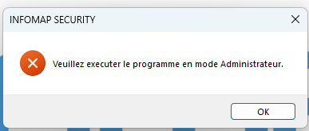

### 📡 Absence de WiFi détectée
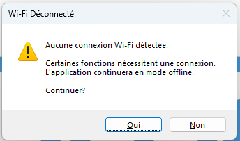

### 🔑 Licence non détectée

### 🧾 Activation licence

### ❌ Licence invalide
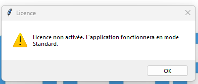

### 📊 Dashboard (chargement hors ligne)
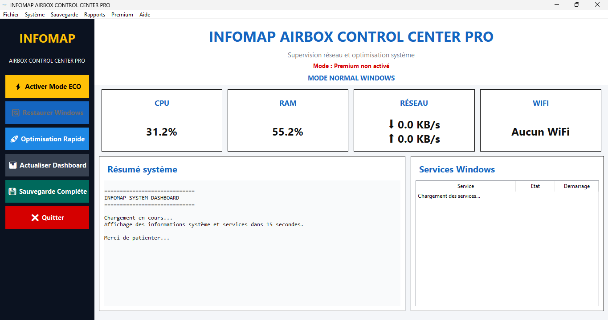

### 📊 Dashboard offline
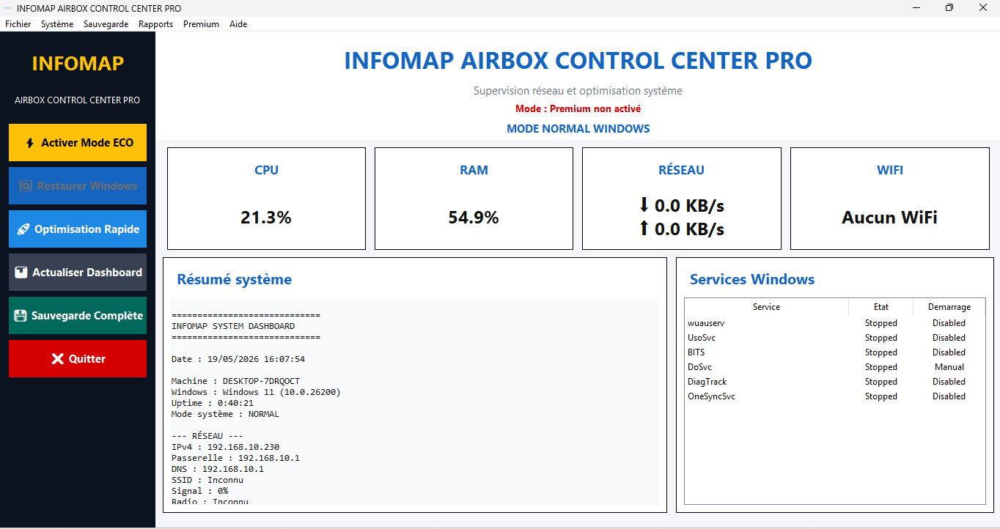

### 🌐 Dashboard en ligne
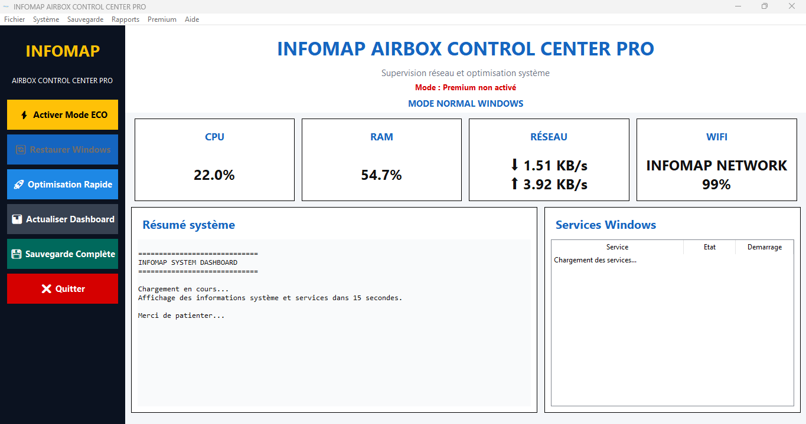

### 📈 Dashboard actif
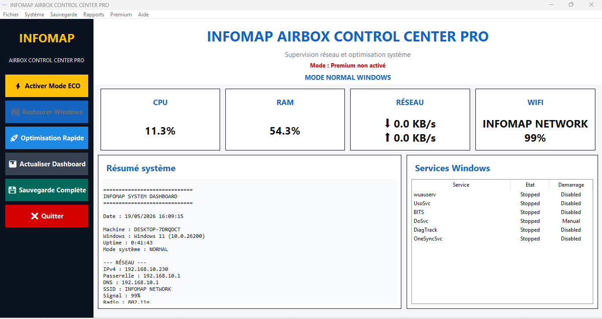

### ⚡ Mode ECO confirmé
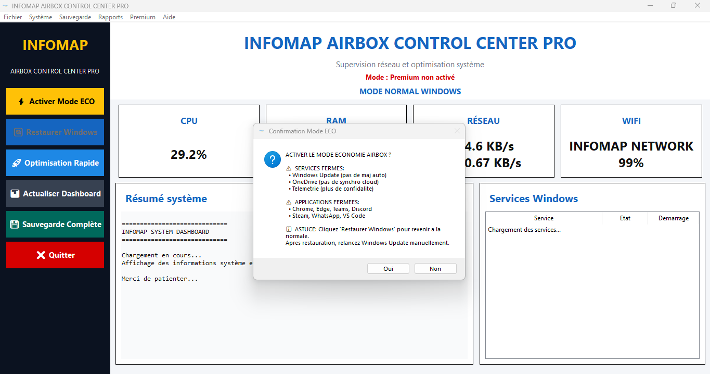

### ℹ️ À propos du système
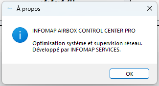

### 💎 Fonction Premium bloquée
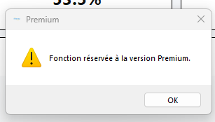

### 🔓 Licence non activée
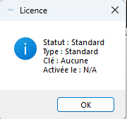

---

## 🔄 Cycle de fonctionnement

- Lancement du programme  
- Vérification système + privilèges administrateur  
- Initialisation du dashboard  
- Activation du monitoring temps réel  
- Collecte CPU / RAM / réseau  
- Mise à jour de l’interface  
- Gestion des modes ECO / RESTORE  
- Sauvegarde des logs et performances  

---

## 💎 Système Premium

Certaines fonctionnalités sont réservées :

- Optimisation intelligente avancée  
- Nettoyage profond système  
- Monitoring professionnel étendu  
- Export de rapports système  
- Alertes réseau WiFi  
- Historique performance avancé  

---

## 🛠️ Technologies utilisées

- Python 3  
- Tkinter (GUI Desktop)  
- psutil (monitoring système)  
- threading (multitâche)  
- JSON (stockage local)  
- PowerShell (Windows API)  
- Windows 10 / 11  

---

## 📊 Statut du projet

- Version : 1.0.0-beta  
- Type : Desktop Windows Application  
- État : En développement actif  
- Auteur : INFOMAP SERVICES RDC  

---

## 🧑‍💻 Développeur

**Ir MWABALI Alexandre Papy**  
Développeur Full Stark  & Réseaux  
Spécialiste systèmes Windows & solutions digitales  

---

## 🏢 Organisation

INFOMAP SERVICES  
Solutions digitales • Monitoring • Réseaux • Automatisation  

---
## 🔐 Accès au projet

Ce dépôt GitHub est publié en version publique limitée.

Le code présenté ici représente une version démonstrative du projet INFOMAP AIRBOX CONTROL CENTER PRO.

Le projet complet, incluant les modules avancés et fonctionnalités premium, reste en version privée et n’est pas accessible publiquement.

---
## 🤝 Partenariats & collaborations

Pour toute demande de partenariat, collaboration ou accès à la version complète :
📧 infomapservicesagence@gmail.com

---
## ⚠️ Note importante

Ce projet est en développement actif.  
Certaines fonctionnalités peuvent évoluer dans les prochaines versions.

---

© 2026 INFOMAP SERVICES RDC  
Tous droits réservés.
